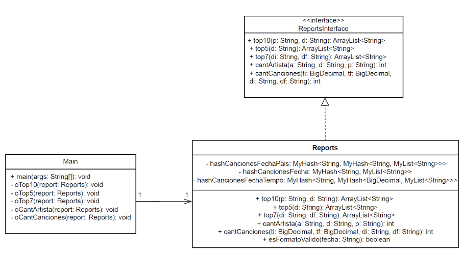
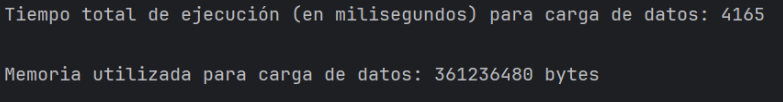
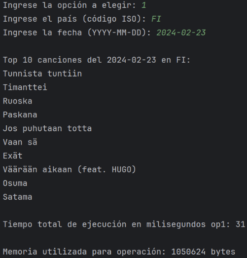
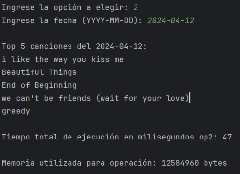
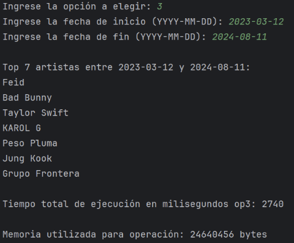
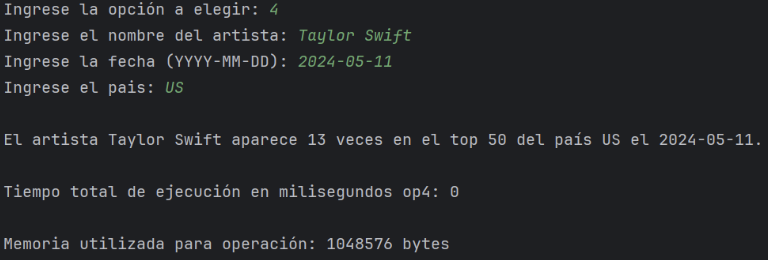
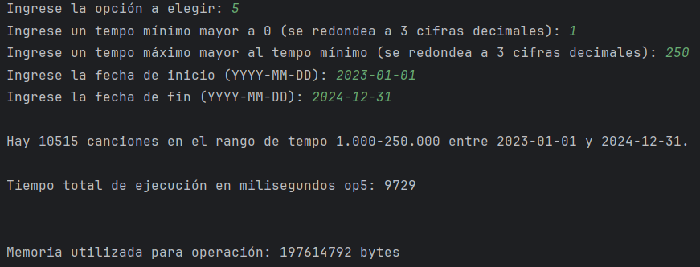

# Obligatorio-Programacion2-Fuidio-Leborgne

## Procesos de carga y decisiones tomadas

1. **Carga de datos:**
    1. **Proceso de carga:** Mediante un buffer reader, leemos cada línea del archivo csv “universal top songs” y las agregamos a 3 estructuras generales distintas (para usos distintos):
        1. hashCancionesFechaPaís: es un hash (busca por fecha) en el cual cada nodo contiene un hash (busca por país) que contiene una lista vinculada de canciones en cada nodo. Por lo tanto, cuando se quiere buscar una canción en una fecha y país dados, se obtienen resultados de manera rápida.
        2. hashCancionesFecha: es un hash (busca por fecha) en el cual cada nodo contiene una lista vinculada de canciones correspondiente a cada fecha.
       3. hashCancionesFechaTempo: es un hash (busca por fecha) que, en cada nodo, contiene un hash (busca por tempo) que, en cada nodo, contiene una lista vinculada de canciones asociadas a una fecha y un tempo específicos.
    2. **Decisiones importantes:** 
        1. Decidimos hacer una sola carga inicial de datos para que el programa sea lo más eficiente posible. Para eso, lo implementamos en el constructor de la clase _Reportes._
        2. En cada línea leída con el bufferreader, separamos con (“,”) para poder acceder a cada atributo de la canción actual. Además, quitamos todas las comillas que sobren para no tener problemas al buscar atributos.
2. **Top10:**
    1. **Proceso de carga:** Utilizamos hashCancionesFechaPais para obtener una lista de canciones en la fecha y país dados. Luego, agregamos todas esas canciones a un hash usando el _daily_rank_ como clave y al mismo tiempo agregamos el _daily_rank_ a un heap para ordenarlos de menor a mayor.
    2. **Decisiones importantes:** Decidimos combinar el uso de heap con el hash para ordenar de manera eficiente los _daily_rank_. Luego extraemos los primeros 10 del heap, buscándolos en el hash creado para obtener las top 10 canciones.
3. **Top5:**
    1. **Proceso de carga:** Usamos hashCancionesFecha para obtener una lista de canciones para la fecha dada. Recorremos dicha lista y agregamos cada canción a un árbol binario de búsqueda. Luego pedimos el inOrder de dicho árbol binario de búsqueda, recorremos la lista devuelta, y utilizamos el mismo método de heap y hash (utilizando la cantidad de veces que aparece una canción como clave) que en top10.
    2. **Decisiones importantes:** Decidimos utilizar un árbol binario de búsqueda binario de búsqueda para almacenar cada canción distinta junto a cuántas veces aparece, ya que el proceso de añadir y buscar es muy eficiente.
4. **Top7:**
    1. **Proceso de carga:** En el rango de fechas dado, iteramos cada un día y buscamos la lista de canciones en el hashCancionesFecha con cada fecha de la iteración. Luego, si la lista de canciones no es null, la recorremos y para cada canción extraemos el o los nombres de cada artista y agregamos a un árbol binario de búsqueda con el nombre de artista como clave. Pedimos el inOrder, recorremos la lista, y utilizamos una combinación de heap y hash usando la cantidad de veces que aparece un artista como clave.
    2. **Decisiones importantes:** Nos dimos cuenta que hay canciones con más de un artista, por lo tanto decidimos separar el atributo _artista_ de la canción por (,) para obtener todos los nombres que haya. Recorremos el array de nombres de artista obtenido por ese split y agregamos a un árbol binario de búsqueda por las mismas razones que en Top5.
5. **CantArtista:**
    1. **Proceso de carga:** Utilizando el hashCancionesFechaPais, obtenemos la lista de canciones con la fecha y top50 dados. Luego, recorremos dicha lista y recorremos los nombres de artista que tenga. Si encontramos un nombre de artista igual al buscado, incrementamos un contador.
    2. **Decisiones importantes:** Comparamos nombres de artistas con equalsIgnoreCase para que no importen las mayúsculas o minúsculas.
6. **CantCanciones:**
    1. **Proceso de carga:** Para cada día en el rango de fechas dado, iteramos cada 0.001 el tempo en el rango dado y con fecha y tempo usamos hashCancionesFechaTempo para obtener la lista de canciones correspondientes. Si la lista de canciones no es null, agregamos el _spotify_id_ a un árbol binario de búsqueda y al finalizar devolvemos el tamaño de la lista inOrder del árbol.
    2. **Decisiones importantes:**
        6. Decidimos usar un bst para contar canciones sin repetir.
        7. Decidimos usar BigDecimal ya que, en la iteración de tempo, la cuenta es más precisa y permite setear una escala exacta de 3 cifras decimales para no tener problemas al buscar en el hash.

## Diagrama UML

## 

## Tiempos de ejecución y memoria utilizada

(Para realizar las pruebas de tiempo y de memoria, probamos cada función con datos tales que sean lo más exigentes posibles)

Tiempo de carga de datos en estructuras 🡪 4165 milisegundos, 361236480 bytes.

Tiempo de ejecución opción 1 (Top 10 canciones en un país en un día dado) 🡪 31 milisegundos, 1050624 bytes.

Tiempo de ejecución opción 2 (Top 5 canciones que aparecen en más top 50 en un día dado) 🡪 47 milisegundos, 12584960 bytes.

Tiempo de ejecución opción 3 (Top 7 artistas que más aparecen en los top 50 para un rango de fechas dado) 🡪 2740 milisegundos, 24640456 bytes.

Tiempo de ejecución opción 4 (Cantidad de veces que aparece un artista específico en un top 50 en una fecha dada)🡪 0 milisegundos, 1048576 bytes.

Tiempo de ejecución opción 5 (Cantidad de canciones con un tempo en un rango específico para un rango específico de fechas)🡪 9729 milisegundos, 197614792 bytes.

### 

### Carga de datos:

### Top 10 canciones en fecha y país dados:

### Top 5 canciones en fecha dada:

### Top 7 artistas en un rango de fechas:

### Cantidad de veces que aparece un artista: \

### Cantidad de canciones en rango de fecha y tempo:

